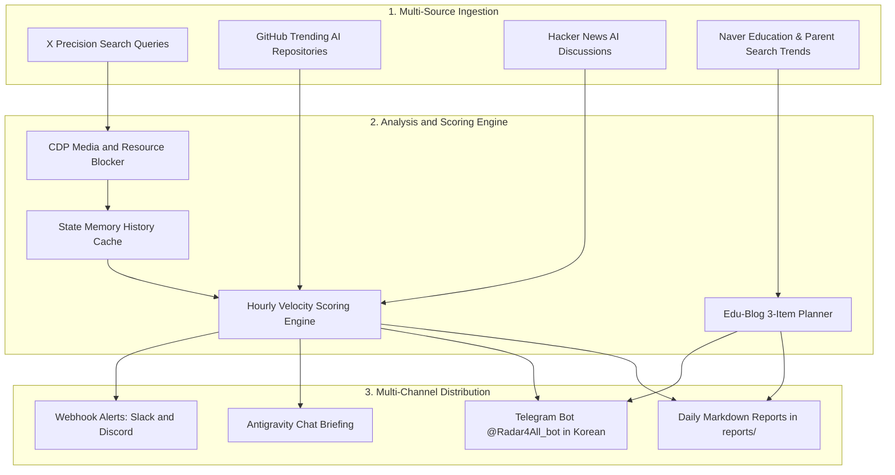

# 🤖 AGENTS.md - X-AI-Radar & Edu-Blog Radar Operating Manual (v2.2)

> **Repository**: [nanbada/X-AI-Radar](https://github.com/nanbada/X-AI-Radar)  
> **Workspace Path**: `/Users/nanbada/projects/X-AI-Radar`  
> **Target Engine**: Antigravity Browser Subagent (`/browser`) & Gemini 3.7 Flash  
> **Architecture**: v2.2 Dual-Engine Multi-Domain Radar (Tech + Education)

---

## 1. Unified Command Protocol (Directive-Subject-Action)

All autonomous agents modifying or executing workflows in this repository MUST follow the **DSA** framework:

| Component | Allowed Values / Pattern | Operational Meaning & Examples |
| :--- | :--- | :--- |
| `<DIRECTIVE>` | `[EXECUTE / OPTIMIZE / UPDATE_TOPIC / UPDATE_SEARCH / UPDATE_WEBHOOK / AUDIT]` | High-level goal of the agent task |
| `<SUBJECT>` | `[config.yaml / scripts/collector.py / scripts/edu_collector.py / scripts/adapters/ / reports/]` | Target configuration, script, or artifact |
| `<ACTION>` | Granular, verifiable step sequence | e.g. "Ingest Naver Edu Trends -> Curate 3 Blog Topics -> Render Markdown -> Send to Telegram" |
| `<TECHNICAL>` | Exact constraints & execution parameters | e.g. "Port: 9223, Engine: Python 3.10+, Model: Gemini 3.7 Flash, Action: Strictly Read-Only" |

---

## 2. v2.2 Dual-Engine Architecture Diagram

---

## 3. Decoupled Subagent Protocols & Roles

### A. Maker Role (Browser Subagent / Ingestion Engine)
- Attaches to Chrome CDP (Port 9223) or requests Naver search endpoints.
- Enables `Network.setBlockedURLs` (`*.mp4`, `*.m3u8`, `*.jpg`, `*.webp`, `*analytics*`).
- Ingests tweet feeds or education queries without message desync (`cdp_send_sync`).

### B. Parallel Adapter Workers (`ThreadPoolExecutor`)
- Concurrently queries GitHub Search API, Hacker News API, and Naver Education search trends.

### C. Checker & Grader Role (Velocity & Scoring Core)
- Validates 24-hour publish timestamp constraints.
- Updates state memory (`data/history.json`) and calculates growth velocity.
- Synthesizes 3-item educational blog topic plans.
- Dispatches Korean-translated summaries to Telegram (`@Radar4All_bot`).

---

## 4. Zero-Trust Security Guardrails

> [!CAUTION]
> **Strict Read-Only Enforcement**:
> - Agents MUST NEVER trigger like, repost, reply, follow, bookmark, or quote actions on X.
> - Agents MUST NEVER submit forms or execute web mutations.

> [!IMPORTANT]
> **Secret & Cache Isolation**:
> - Ensure all local tracking data (`data/*.json`), Chrome profile directories, `.env` files (containing Telegram tokens), and temporary logs remain ignored in `.gitignore`.
