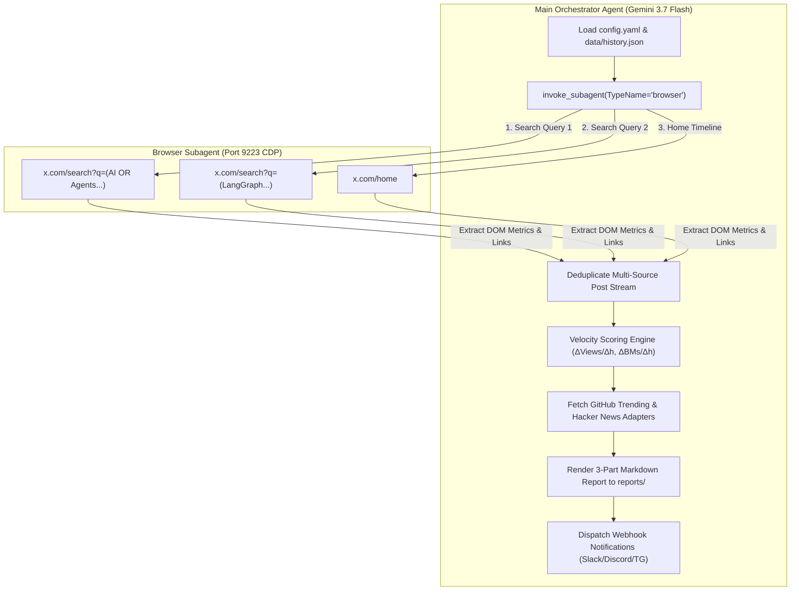

# 🤖 AGENTS.md - X-AI-Radar Autonomous Agent Operating Manual

> **Repository**: [nanbada/X-AI-Radar](https://github.com/nanbada/X-AI-Radar)  
> **Workspace Path**: `/Users/nanbada/projects/X-AI-Radar`  
> **Target Engine**: Antigravity Browser Subagent (`/browser`) & Gemini 3.7 Flash  
> **Architecture**: v2.0 Multi-Source Intelligence with State Memory & Velocity Scoring

---

## 1. Unified Command Protocol (Directive-Subject-Action)

All autonomous agent modifications and execution flows in this repository MUST adhere to the **DSA** framework:

| Component | Allowed Values / Structure | Description & Examples |
| :--- | :--- | :--- |
| `<DIRECTIVE>` | `[EXECUTE / UPDATE_TOPIC / UPDATE_SEARCH / UPDATE_ADAPTERS / UPDATE_WEBHOOK / AUDIT]` | High-level operational goal |
| `<SUBJECT>` | `[config.yaml / scripts/collector.py / scripts/adapters/ / reports/]` | Target configuration or component |
| `<ACTION>` | Granular, verifiable step sequence | e.g. "Ingest 2 Search Queries -> Calculate Velocity against data/history.json -> Render Markdown" |
| `<TECHNICAL>` | Execution constraints & parameters | e.g. "Port: 9223, Model: Gemini 3.7 Flash, Action: Strictly Read-Only" |

---

## 2. Multi-Source Autonomous Architecture (v2.0)

### Decoupled Subagent Roles:
1. **Maker (Browser Subagent)**: Connects to Chrome CDP (Port 9223), navigates target search URLs and timeline, extracts DOM elements (`article[data-testid="tweet"]`), metric counters, thread indicators, and external URLs (GitHub/ArXiv).
2. **Checker & Grader (Main Orchestrator)**: Evaluates published timestamps (24h window), computes historical growth delta against `data/history.json`, ranks items by Velocity Score, fetches multi-platform adapters, and formats the executive briefing.

---

## 3. Memory Lifecycle & Velocity Scoring

### A. State Memory (`data/history.json`)
- **Key**: `tweetUrl` or `handle + text[:30]`
- **Payload**: `{"last_seen_at": ISO8601, "views": int, "likes": int, "bookmarks": int, "score": float}`
- **Retention**: Records older than `memory.max_history_days` (default: 7 days) are automatically pruned on each cycle.

### B. Mathematical Scoring Formula
For previously observed posts (`[RISING]` / `[HOT]`):
$$\text{VelocityScore} = \left(\frac{\Delta \text{Views}}{\Delta \text{Hours}} \times w_{v}\right) + \left(\frac{\Delta \text{Bookmarks}}{\Delta \text{Hours}} \times w_{bm}\right) + \text{Bonus} + (\text{Likes} \times 0.5)$$

For newly discovered posts (`[NEW]`):
$$\text{VelocityScore} = \left(\frac{\text{Views}}{\text{WindowHours}} \times w_{v}\right) + (\text{Likes} \times w_{l}) + (\text{Reposts} \times w_{r}) + (\text{Bookmarks} \times w_{bm}) + \text{Bonus}$$

* **Bonus Allocations**:
  - `boost_keywords` match: +150.0 pts per token
  - `Thread (1/n or 🧵)` detected: +100.0 pts
  - `GitHub repo link` embedded: +150.0 pts
  - `ArXiv paper link` embedded: +150.0 pts

---

## 4. Extensibility Guide for Agents

### A. Modifying Target Search Queries & Topics
- Edit `config.yaml` under `browser.search_queries` and `topics.boost_keywords`.
- Use precision query operators (e.g. `min_faves:50`, `lang:en`, `-filter:replies`).

### B. Configuring Webhook Integrations
- Enable notifications in `config.yaml`: `notifications.enabled: true`.
- Provide endpoint in `notifications.webhooks.slack`, `discord`, or `telegram_bot_token` / `telegram_chat_id`.

### C. Schedule Modification
- Default cron is `15 8 * * *` (08:15 KST daily).
- Register or update via Antigravity tool `schedule` with `IsDaemon: true`.

---

## 5. Zero-Trust Security & Safety Guardrails

> [!CAUTION]
> **Strict Read-Only Policy**:
> - Agents MUST NEVER trigger like, repost, reply, follow, bookmark, or quote actions on X.
> - Agents MUST NEVER submit forms or mutate web application state.

> [!IMPORTANT]
> **Credential & Profile Protection**:
> - Never write API tokens, webhook secrets, or session cookies into source code or public git commits.
> - All sensitive cache files are isolated in `.gitignore` (`data/*.json`, `*profile*/`, `.env`).
