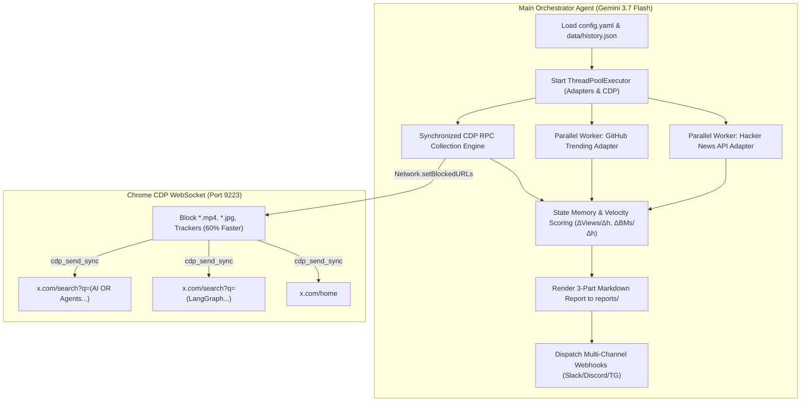

# 🤖 AGENTS.md - X-AI-Radar Autonomous Agent Operating Manual (v2.1)

> **Repository**: [nanbada/X-AI-Radar](https://github.com/nanbada/X-AI-Radar)  
> **Workspace Path**: `/Users/nanbada/projects/X-AI-Radar`  
> **Target Engine**: Antigravity Browser Subagent (`/browser`) & Gemini 3.7 Flash  
> **Architecture**: v2.1 High-Performance Multi-Source Intelligence Engine (~17s latency)

---

## 1. Unified Command Protocol (Directive-Subject-Action)

All autonomous agents modifying or executing workflows in this repository MUST follow the **DSA** framework:

| Component | Allowed Values / Pattern | Operational Meaning & Examples |
| :--- | :--- | :--- |
| `<DIRECTIVE>` | `[EXECUTE / OPTIMIZE / UPDATE_TOPIC / UPDATE_SEARCH / UPDATE_WEBHOOK / AUDIT]` | High-level goal of the agent task |
| `<SUBJECT>` | `[config.yaml / scripts/collector.py / scripts/adapters/ / reports/]` | Target configuration, script, or artifact |
| `<ACTION>` | Granular, verifiable step sequence | e.g. "Ingest 2 Search Queries + Home Timeline via CDP -> Block Media -> Compute Velocity -> Render Markdown" |
| `<TECHNICAL>` | Exact constraints & execution parameters | e.g. "Port: 9223, Model: Gemini 3.7 Flash, Latency Goal: <20s, Action: Strictly Read-Only" |

---

## 2. v2.1 High-Performance Architecture Diagram

---

## 3. Decoupled Subagent Protocols & Roles

### A. Maker Role (Browser Subagent / Ingestion Engine)
- Attaches to Chrome CDP (Port 9223).
- Enables `Network.setBlockedURLs` (`*.mp4`, `*.m3u8`, `*.jpg`, `*.webp`, `*analytics*`).
- Sequentially navigates target search URLs and Home timeline with zero message desync (`cdp_send_sync`).
- Extracts tweet metadata, metric counters, `1/n` thread indicators, and external technical URLs (`github.com`, `arxiv.org`).

### B. Parallel Adapter Workers (`ThreadPoolExecutor`)
- Concurrently queries GitHub Search API for trending AI/Agent repositories (⭐ stars, language, description).
- Concurrently queries Hacker News Firebase API for active AI discussions (points, comments, URL).

### C. Checker & Grader Role (Velocity & Scoring Core)
- Validates 24-hour publish timestamp constraints.
- Updates state memory (`data/history.json`) and calculates growth velocity:
  $$\text{VelocityScore} = \left(\frac{\Delta \text{Views}}{\Delta \text{Hours}} \times 0.2\right) + \left(\frac{\Delta \text{Bookmarks}}{\Delta \text{Hours}} \times 5.0\right) + \text{Bonus} + (\text{Likes} \times 0.5)$$
- Generates the executive briefing and persists the daily markdown report.

---

## 4. Agent Extensibility & Customization Rules

### A. Modifying Search Queries & Keywords
* **Target File**: `config.yaml` (`browser.search_queries` & `topics.boost_keywords`)
* **Rule**: Always test search queries with strict operators (`min_faves:50`, `lang:en`, `-filter:replies`) to ensure zero algorithmic noise.

### B. Memory Lifecycle Tuning
* **Target File**: `config.yaml` (`memory:` section)
* **Rule**: Records older than `memory.max_history_days` (default: 7) are automatically pruned on each cycle.

### C. Webhook Integration
* **Target File**: `config.yaml` (`notifications:` section)
* **Rule**: Set `notifications.enabled: true` and configure `slack`, `discord`, or `telegram` credentials.

---

## 5. Zero-Trust Security Guardrails

> [!CAUTION]
> **Strict Read-Only Enforcement**:
> - Agents MUST NEVER trigger like, repost, reply, follow, bookmark, or quote actions on X.
> - Agents MUST NEVER submit forms or execute web mutations.

> [!IMPORTANT]
> **Secret & Cache Isolation**:
> - Ensure all local tracking data (`data/*.json`), Chrome profile directories, `.env` files, and temporary logs remain ignored in `.gitignore`.
