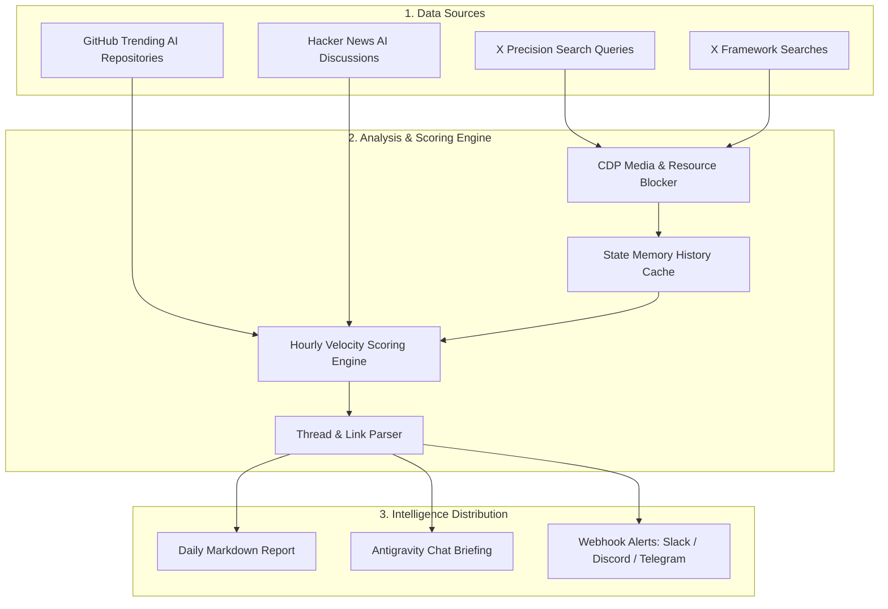

# 📡 X-AI-Radar (v2.1)

<p align="center">
  <b>Multi-Source Autonomous AI & Agents Intelligence Radar</b><br>
  Powered by <b>Antigravity Browser Subagent (<code>/browser</code>)</b> and <b>Gemini 3.7 Flash</b>.<br>
  <i>⚡ High-Speed Engine: Ingests X, GitHub Trending, and Hacker News in ~17 seconds.</i>
</p>

<p align="center">
  <a href="#-key-features">Key Features</a> •
  <a href="#-benchmark--performance">Benchmark</a> •
  <a href="#-architecture">Architecture</a> •
  <a href="#-quick-start">Quick Start</a> •
  <a href="#-configuration">Configuration</a> •
  <a href="#-security--safety">Security</a> •
  <a href="./README_KO.md">한국어 문서 (Korean)</a>
</p>

---

## 🌟 Key Features

- **⚡ Blazing Fast (~17s Full Run)**: Utilizes Chrome DevTools Protocol (CDP) with media resource blocking (`*.mp4`, `*.jpg`, trackers) and parallel adapter thread pools to deliver complete reports in under 18 seconds.
- **Zero-Cost & Ban-Free Ingestion**: Reuses your local Chrome session (Port 9223). No expensive API tiers ($100–$5,000/mo) or fragile scraping tokens.
- **Precision Target Search**: Ingests high-signal AI posts via search operators (`min_faves:50`, `lang:en`) to completely filter out general algorithmic timeline noise.
- **State Memory & Velocity-based Heat Scoring**: Tracks hourly growth delta (Views/h, Bookmarks/h) via `data/history.json` to prioritize breakout (`[RISING]`) topics over stale multi-day trends.
- **Thread & External Link Inspection**: Automatically identifies `1/n` technical threads and extracts embedded GitHub repositories and ArXiv research papers.
- **Multi-Platform Intelligence Adapters**: Aggregates **GitHub Trending AI Repositories** and **Hacker News AI Discussions** into a unified 3-part daily executive brief.
- **Multi-Channel Webhook Alerts**: Automatically pushes Top 3 daily highlights to Slack, Discord, and Telegram.
- **Strictly Read-Only (100% Safe)**: Enforces zero-mutation policy (no likes, retweets, replies, or follows).

---

## ⏱️ Benchmark & Performance

```text
⚡ [X-AI-Radar v2.1] Real-World Benchmark Results
─────────────────────────────────────────────────────────────
• Sources Queried: 2 X Precision Queries + Home Timeline + GitHub API + Hacker News API
• Deduplicated Stream: 27 X Posts + 5 GitHub Repos + 2 HN Discussions
• Total Execution Time: 17.16 seconds
```

---

## 🏗️ Architecture



---

## 📂 Project Structure

```text
X-AI-Radar/
├── AGENTS.md                  # Autonomous agent operating protocol (DSA standard)
├── SKILL.md                   # Antigravity custom skill specification (/x-ai-radar)
├── config.yaml                # Unified configuration (Search queries, scoring, webhooks)
├── README.md                  # English documentation
├── README_KO.md               # Korean documentation (한국어 가이드)
├── .gitignore                 # Security & secret isolation rules
├── data/
│   ├── .gitkeep
│   └── history.json           # Local cache for state memory & velocity tracking (ignored)
├── scripts/
│   ├── collector.py           # Core v2.1 high-speed multi-source engine (~17s)
│   ├── notifier.py            # Slack / Discord / Telegram webhook dispatcher
│   ├── launch_chrome.sh       # Chrome Remote Debugging (Port 9223) launcher
│   ├── run_radar.sh           # Environment health checker & manual CLI runner
│   └── adapters/
│       ├── github_trending.py # GitHub Trending AI adapter
│       └── hackernews.py      # Hacker News AI discussions adapter
├── templates/
│   └── report_template.md     # 3-part comprehensive markdown report template
└── reports/                   # Daily generated reports (x-ai-radar-YYYY-MM-DD.md)
```

---

## 🚀 Quick Start

### 1. Launch Chrome in Remote Debugging Mode
Launch an isolated Chrome profile on port 9223. Perform a **one-time manual login to X (Twitter)** in the opened browser window:

```bash
./scripts/launch_chrome.sh
```

### 2. Run X-AI-Radar Manually
In your Antigravity chat, type:
```text
/x-ai-radar
```
Or execute directly from your terminal:
```bash
python3 scripts/collector.py
```

### 3. Schedule Daily Autonomous Execution (08:15 KST)
Register the recurring task with Antigravity:
```text
/schedule
CronExpression: "15 8 * * *"
Prompt: "/x-ai-radar"
IsDaemon: true
```

---

## ⚙️ Configuration (`config.yaml`)

```yaml
# Target Search Queries
browser:
  cdp_port: 9223
  search_queries:
    - "https://x.com/search?q=(AI%20OR%20Agents%20OR%20LLM%20OR%20MCP)%20min_faves%3A50&f=live"
    - "https://x.com/search?q=(LangGraph%20OR%20CrewAI%20OR%20AutoGen)%20min_faves%3A30&f=live"

# State Memory & Velocity Weights
memory:
  enabled: true
  history_file: "data/history.json"
  velocity_weight_views: 0.2
  velocity_weight_bookmarks: 5.0

# Multi-Channel Webhook Notifications
notifications:
  enabled: true
  webhooks:
    slack: "https://hooks.slack.com/services/..."
    discord: "https://discord.com/api/webhooks/..."
    telegram_bot_token: "YOUR_BOT_TOKEN"
    telegram_chat_id: "YOUR_CHAT_ID"
```

---

## 🛡️ Security & Safety

1. **Zero-Mutation Guardrail**: The engine strictly executes DOM reads and navigation. All write operations (like, retweet, reply, bookmark, follow) are hard-disabled.
2. **Profile Isolation**: Uses a dedicated `--user-data-dir` (`$HOME/chrome_agent_profile`), keeping your personal browsing cookies completely untouched.
3. **Secret Protection**: `.gitignore` prevents publishing session data (`data/*.json`), environment files (`.env`), or local logs to git.

---

## 📄 License & Attribution

Distributed under the MIT License. Developed for the Google Antigravity & AI Agent ecosystem.  
Repository: [nanbada/X-AI-Radar](https://github.com/nanbada/X-AI-Radar)
