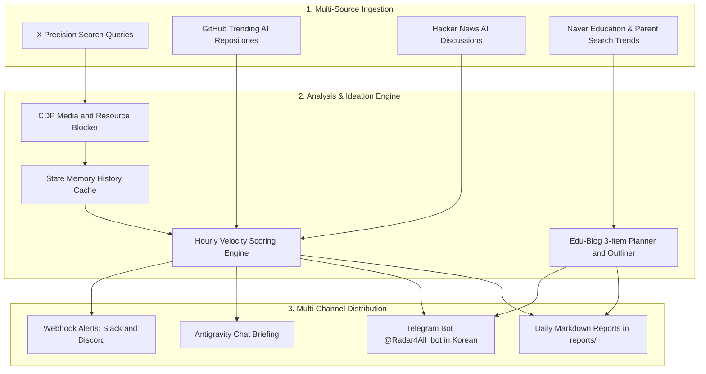

# 📡 X-AI-Radar & Edu-Blog Radar (v2.2)

<p align="center">
  <b>Multi-Domain Autonomous Intelligence & Blog Ideation Radar</b><br>
  Powered by <b>Antigravity Browser Subagent (<code>/browser</code>)</b> and <b>Gemini 3.7 Flash</b>.<br>
  <i>⚡ Dual Engine: AI & Agents Tech Radar (~17s) + Elementary & Middle School Edu-Blog Radar (3 Daily Items)</i><br>
  <i>💻 100% Cross-Platform: macOS, Windows (Batch / PowerShell), and Linux Supported.</i>
</p>

<p align="center">
  <a href="#-dual-intelligence-engines">Dual Engines</a> •
  <a href="#-key-features">Key Features</a> •
  <a href="#-architecture">Architecture</a> •
  <a href="#-quick-start">Quick Start (macOS / Windows)</a> •
  <a href="#-customizing-topics">Customizing Topics</a> •
  <a href="#-project-structure">Project Structure</a> •
  <a href="./README_KO.md">한국어 설명서 (Korean)</a>
</p>

---

## 🚀 Dual Intelligence Engines

X-AI-Radar features two specialized, turnkey intelligence engines that deliver automated briefings to your **Telegram (`@Radar4All_bot`)**, Slack, Discord, and Markdown reports:

```text
┌─────────────────────────────────────────────────────────────────────────────┐
│ 1. 🤖 X-AI-Radar (Tech Engine)                                              │
│    • Target: Global AI, Autonomous Agents, LLM, MCP, and GitHub Trending    │
│    • Latency: ~17 seconds via Chrome CDP Media Resource Blocker             │
│    • Runner: python scripts/collector.py (or scripts/run_radar.bat)        │
├─────────────────────────────────────────────────────────────────────────────┤
│ 2. 🎓 Edu-Blog Radar (Education & Parent Blog Engine)                       │
│    • Target: Elementary/Middle School Fun Study Tips, Seasonal Study Items  │
│    • Output: Top 3 Actionable Blog Topic Outlines & SEO Hashtags            │
│    • Runner: python scripts/edu_collector.py (or scripts/run_edu_radar.bat)│
└─────────────────────────────────────────────────────────────────────────────┘
```

---

## 🌟 Key Features

- **⚡ Blazing Fast Ingestion**: Uses Chrome DevTools Protocol (CDP) with media resource blocking (`*.mp4`, `*.jpg`, trackers) and parallel adapter thread pools to deliver full reports in under 18 seconds.
- **💻 Turnkey Cross-Platform (macOS / Windows / Linux)**: Dedicated one-click launchers for macOS/Linux (`.sh`), Windows Command Prompt (`.bat`), and PowerShell (`.ps1`).
- **🎯 3-Item Edu-Blog Generator**: Analyzes parent and student concerns from Naver and Google search to produce ready-to-publish blog drafts (Hook titles, 3-step outlines, and SEO hashtags).
- **Zero-Cost & Ban-Free**: Reuses your local Chrome session (Port 9223). Zero expensive API tiers or fragile scraping tokens.
- **State Memory & Velocity Scoring**: Tracks hourly growth delta (Views/h, Bookmarks/h) via `data/history.json` to prioritize breakout (`[RISING]`) topics.
- **📱 Telegram Korean Translation Dispatch**: Automatically translates foreign tech posts into fluent Korean and sends alerts directly to `@Radar4All_bot`.
- **🛡️ Strictly Read-Only (100% Safe)**: Enforces zero-mutation policy (no likes, retweets, replies, or follows).

---

## 🏗️ Architecture



---

## 📂 Project Structure

```text
X-AI-Radar/
├── AGENTS.md                  # Autonomous agent operating manual (DSA standard)
├── SKILL.md                   # Antigravity custom skill specification (/x-ai-radar)
├── config.yaml                # Unified configuration (Search queries, scoring, webhooks)
├── README.md                  # Global English documentation
├── README_KO.md               # Korean user manual (한국어 가이드)
├── .gitignore                 # Security & secret isolation rules
├── .env                       # Local secrets (Telegram bot token & chat id, git-ignored)
├── data/
│   ├── .gitkeep
│   └── history.json           # Local cache for state memory & velocity tracking (ignored)
├── scripts/
│   ├── collector.py           # Core v2.1 high-speed AI & tech intelligence engine (~17s)
│   ├── edu_collector.py       # Edu-Blog Radar: Elementary & Middle school 3-item planner
│   ├── notifier.py            # Multi-channel webhook & Telegram Korean translator
│   ├── setup_telegram.py      # Interactive Telegram bot link helper
│   ├── launch_chrome.sh       # Chrome CDP launcher for macOS / Linux
│   ├── launch_chrome.bat      # Chrome CDP launcher for Windows CMD
│   ├── launch_chrome.ps1      # Chrome CDP launcher for Windows PowerShell
│   ├── run_radar.sh           # AI Radar runner for macOS / Linux
│   ├── run_radar.bat          # AI Radar runner for Windows
│   ├── run_edu_radar.sh       # Edu-Blog Radar runner for macOS / Linux
│   ├── run_edu_radar.bat      # Edu-Blog Radar runner for Windows
│   └── adapters/
│       ├── github_trending.py # GitHub Trending AI adapter
│       ├── hackernews.py      # Hacker News AI discussions adapter
│       └── naver_edu.py       # Naver education search & trends adapter
├── templates/
│   ├── report_template.md     # 3-part AI tech intelligence report template
│   └── edu_report_template.md # 3-item educational blog ideation template
└── reports/                   # Daily generated reports (*.md)
```

---

## 🚀 Quick Start (macOS / Windows / Linux)

### 1. Launch Chrome in Remote Debugging Mode (Port 9223)

* **macOS / Linux**:
  ```bash
  ./scripts/launch_chrome.sh
  ```
* **Windows (Command Prompt / Double Click)**:
  ```cmd
  scripts\launch_chrome.bat
  ```
* **Windows (PowerShell)**:
  ```powershell
  .\scripts\launch_chrome.ps1
  ```

> [!NOTE]
> In the opened Chrome window, perform a **one-time login to X.com**. The session is saved in an isolated directory (`chrome_agent_profile`) and will be reused automatically.

### 2. Run the Intelligence Engines

#### A. AI & Tech Intelligence Radar (X-AI-Radar)
* **In Antigravity Chat**: Type `/x-ai-radar`
* **Via Terminal**: `python scripts/collector.py`
* **Windows One-Click**: Double-click `scripts\run_radar.bat`

#### B. Educational & Parent Blog Radar (Edu-Blog Radar)
* **Via Terminal**: `python scripts/edu_collector.py`
* **Windows One-Click**: Double-click `scripts\run_edu_radar.bat`

### 3. Schedule Daily Autonomous Execution (08:15 KST)
Register the recurring task with Antigravity:
```text
/schedule
CronExpression: "15 8 * * *"
Prompt: "/x-ai-radar"
IsDaemon: true
```

---

## 🎯 Customizing Topics & Search Queries

You can easily adapt X-AI-Radar to track any domain (Robotics, Web3, Healthcare AI, Specific LLMs, etc.) by modifying `config.yaml`:

```yaml
browser:
  search_queries:
    # Example A: AI Agents & Reasoning Models
    - "https://x.com/search?q=(AI%20OR%20Agents%20OR%20Reasoning%20OR%20MCP)%20min_faves%3A50&f=live"
    
    # Example B: Robotics & Physical AI
    - "https://x.com/search?q=(Robotics%20OR%20Humanoid%20OR%20PhysicalAI)%20min_faves%3A30&f=live"
```

---

## 🛡️ Security & Safety

1. **Zero-Mutation Guardrail**: The engine strictly executes DOM reads and navigation. All write operations (like, retweet, reply, bookmark, follow) are hard-disabled.
2. **Profile Isolation**: Uses a dedicated `--user-data-dir` (`chrome_agent_profile`), keeping your personal browsing cookies completely untouched.
3. **Secret Protection**: `.gitignore` prevents publishing session data (`data/*.json`), environment files (`.env`), or local logs to git.

---

## 📄 License & Attribution

Distributed under the MIT License. Developed for the Google Antigravity & AI Agent ecosystem.  
Repository: [nanbada/X-AI-Radar](https://github.com/nanbada/X-AI-Radar)
