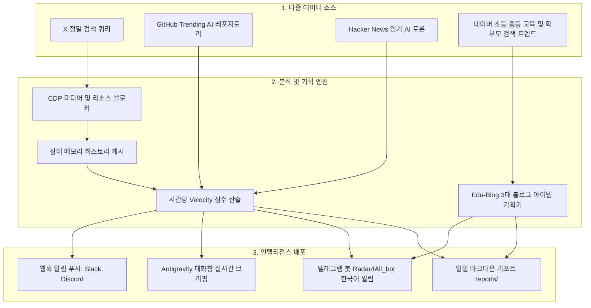

# 📡 X-AI-Radar & Edu-Blog Radar (v2.2 한국어 설명서)

<p align="center">
  <b>Antigravity Browser Subagent(<code>/browser</code>) 및 Gemini 3.7 Flash 기반의 다중 도메인 자율 인텔리전스 & 블로그 기획 레이더</b><br>
  <i>⚡ 듀얼 엔진: 글로벌 AI/Agents 기술 레이더 (~17초) + 초·중등 학부모 블로그 아이템 3종 기획 레이더</i><br>
  <i>💻 크로스 플랫폼: macOS, Windows (배치/PowerShell), Linux 100% 완벽 지원</i>
</p>

<p align="center">
  <a href="#-듀얼-인텔리전스-엔진">듀얼 엔진</a> •
  <a href="#-핵심-특징">핵심 특징</a> •
  <a href="#-시스템-아키텍처">시스템 아키텍처</a> •
  <a href="#-빠른-시작-가이드-macos--windows--linux">빠른 시작 (macOS / Windows)</a> •
  <a href="#-검색-이슈-및-주제-변경-방법">주제 변경 방법</a> •
  <a href="#-프로젝트-구조">프로젝트 구조</a> •
  <a href="./README.md">English Version</a>
</p>

---

## 🚀 듀얼 인텔리전스 엔진 (Dual Engines)

X-AI-Radar는 사용자의 목적에 따라 2가지 독립된 고성능 인텔리전스 엔진을 제공하며, 수집 및 분석 결과를 **텔레그램(`@Radar4All_bot`)**, Slack, Discord 및 일일 마크다운 리포트로 자동 배달합니다:

```text
┌─────────────────────────────────────────────────────────────────────────────┐
│ 1. 🤖 X-AI-Radar (글로벌 테크 엔진)                                         │
│    • 대상: 전 세계 AI, Autonomous Agents, LLM, MCP, GitHub Trending         │
│    • 성능: CDP 리소스 블로킹 적용으로 약 17초 만에 쾌속 수집 및 분석        │
│    • 실행: python scripts/collector.py (또는 scripts/run_radar.bat)        │
├─────────────────────────────────────────────────────────────────────────────┤
│ 2. 🎓 Edu-Blog Radar (교육 & 학부모 블로그 기획 엔진)                       │
│    • 대상: 초등·중등 재미있는 공부법, 내신 전략, 시즌별 학습 꿀템           │
│    • 결과: 클릭률 높은 추천 제목 3종, 3단 본문 구성안, SEO 해시태그         │
│    • 실행: python scripts/edu_collector.py (또는 scripts/run_edu_radar.bat)│
└─────────────────────────────────────────────────────────────────────────────┘
```

---

## 🌟 핵심 특징

- **⚡ 17초 초고속 파이프라인**: 브라우저 미디어 리소스 블로킹(`*.mp4`, `*.jpg`, 트래커 차단)과 병렬 어댑터 풀을 적용하여 전체 수집 및 분석을 18초 이내에 완료합니다.
- **💻 완벽한 윈도우(Windows) & Mac 지원**: macOS/Linux용(`.sh`), Windows 배치 파일(`.bat`), PowerShell(`.ps1`) 전용 원클릭 실행기를 모두 제공합니다.
- **🎯 초·중등 블로그 아이템 3종 자동 기획**: 네이버 검색 및 학부모 실시간 고민을 분석하여 블로그에 바로 쓸 수 있는 완성형 초안(제목 3종, 본문 3단 목차, 해시태그)을 생성합니다.
- **비용 0원 & 계정 차단 제로**: 월 수백~수천 달러의 X API v2 유료 요금제 대신, 로컬 Chrome Remote Debugging(CDP, Port 9223) 세션을 활용하여 100% 안전하게 동작합니다.
- **상태 기억(Memory) & Velocity 점수**: `data/history.json`에 과거 지표를 캐싱하여, 며칠 동안 멈춰있는 과거 인기글 대신 **"최근 몇 시간 동안 폭발적으로 증가한 포스트(`[RISING]`)"**를 우선 순위로 랭킹합니다.
- **📱 텔레그램 한국어 자동 번역 발송**: 해외 최신 AI 포스트를 자연스러운 한국어로 즉시 번역하여 텔레그램(`@Radar4All_bot`)으로 전송합니다.
- **100% 읽기 전용 (Strictly Read-Only)**: 좋아요, 리트윗, 댓글, 팔로우 등의 쓰기 동작을 원천 차단하여 계정 안전을 보장합니다.

---

## 🏗️ 시스템 아키텍처



---

## 📂 프로젝트 구조

```text
X-AI-Radar/
├── AGENTS.md                  # 에이전트 자율 운영 및 확장 매뉴얼 (DSA 표준)
├── SKILL.md                   # Antigravity 커스텀 스킬 정의서 (/x-ai-radar, /edu-blog-radar)
├── config.yaml                # 통합 설정 (Search 쿼리, 가중치, 웹훅 등)
├── README.md                  # 글로벌 영문 매뉴얼
├── README_KO.md               # 한국어 종합 매뉴얼
├── .gitignore                 # 보안 및 캐시 파일 격리 설정
├── .env                       # 텔레그램 봇 토큰 및 챗 ID (Git 제외)
├── data/
│   ├── .gitkeep
│   └── history.json           # 수집 이력 및 Velocity 계산용 상태 메모리 (Git 제외)
├── scripts/
│   ├── collector.py           # v2.1 고속 AI 기술 수집 & Velocity 랭킹 코어 엔진 (~17s)
│   ├── edu_collector.py       # Edu-Blog Radar: 초·중등 블로그 아이템 3종 기획 엔진
│   ├── notifier.py            # Slack / Discord / 텔레그램 한국어 자동 번역 발송기
│   ├── setup_telegram.py      # 텔레그램 봇 간편 연동 헬퍼
│   ├── launch_chrome.sh       # macOS / Linux용 Chrome 실행기
│   ├── launch_chrome.bat      # Windows CMD용 Chrome 원클릭 실행기
│   ├── launch_chrome.ps1      # Windows PowerShell용 Chrome 실행기
│   ├── run_radar.sh           # AI Radar 점검 및 수동 실행기 (macOS/Linux)
│   ├── run_radar.bat          # AI Radar 점검 및 수동 실행기 (Windows)
│   ├── run_edu_radar.sh       # Edu-Blog Radar 수동 실행기 (macOS/Linux)
│   ├── run_edu_radar.bat      # Edu-Blog Radar 수동 실행기 (Windows)
│   └── adapters/
│       ├── github_trending.py # GitHub Trending AI 어댑터
│       ├── hackernews.py      # Hacker News AI 토론 어댑터
│       └── naver_edu.py       # 네이버 교육 검색 및 학부모 트렌드 어댑터
├── templates/
│   ├── report_template.md     # 3단 종합 AI 테크 일일 마크다운 리포트 템플릿
│   └── edu_report_template.md # 초·중등 블로그 아이템 3종 전용 리포트 템플릿
└── reports/                   # 매일 자동 생성되는 리포트 저장 디렉터리
```

---

## 🚀 빠른 시작 가이드 (macOS / Windows / Linux)

### 1단계: Chrome Remote Debugging 모드 실행 (Port 9223)

* **macOS / Linux 사용자**:
  ```bash
  ./scripts/launch_chrome.sh
  ```
* **Windows 사용자 (CMD / 더블 클릭)**:
  `scripts\launch_chrome.bat` 파일을 더블 클릭하거나 명령 프롬프트에서 실행:
  ```cmd
  scripts\launch_chrome.bat
  ```
* **Windows 사용자 (PowerShell)**:
  ```powershell
  .\scripts\launch_chrome.ps1
  ```

> [!NOTE]
> 열린 크롬 창에서 **최초 1회 X(Twitter) 로그인**을 완료합니다. 로그인 세션은 독립 프로필(`chrome_agent_profile`)에 안전하게 저장되어 다음부터 자동으로 유지됩니다.

### 2단계: 원하는 레이더 실행

#### A. AI & 테크 레이더 (X-AI-Radar) 실행
* **Antigravity 채팅창**: `/x-ai-radar` 입력
* **터미널 실행**: `python scripts/collector.py`
* **Windows 원클릭**: `scripts\run_radar.bat` 더블 클릭

#### B. 초·중등 교육 블로그 기획 레이더 (Edu-Blog Radar) 실행
* **터미널 실행**: `python scripts/edu_collector.py`
* **Windows 원클릭**: `scripts\run_edu_radar.bat` 더블 클릭

### 3단계: 매일 아침 08:15 자동 실행 등록 (`/schedule`)
Antigravity에 스케줄러를 등록하면 매일 아침 정해진 시간에 자동으로 최신 리포트가 생성되고 텔레그램으로 전송됩니다:
```text
/schedule
CronExpression: "15 8 * * *"
Prompt: "/x-ai-radar"
IsDaemon: true
```

---

## 🎯 검색 이슈 및 주제 변경 방법 (Customization)

`config.yaml` 파일만 수정하면 **로보틱스(Robotics), Web3, 헬스케어 AI, 퀀트 금융, 특정 모델(Claude, DeepSeek, Grok) 등** 원하는 모든 도메인으로 레이더를 손쉽게 전환할 수 있습니다:

```yaml
browser:
  search_queries:
    # 예시 A: AI Agents & 추론 모델 집중 추적
    - "https://x.com/search?q=(AI%20OR%20Agents%20OR%20Reasoning%20OR%20MCP)%20min_faves%3A50&f=live"
    
    # 예시 B: 로보틱스 & 피지컬 AI 도메인으로 변경
    - "https://x.com/search?q=(Robotics%20OR%20Humanoid%20OR%20PhysicalAI)%20min_faves%3A30&f=live"
```

---

## 🛡️ 보안 및 안전 수칙

1. **Strict Read-Only**: 모든 쓰기 작업(좋아요, 리트윗, 댓글, 팔로우 등)을 원천 차단하여 안전하게 탐색합니다.
2. **프로필 완전 분리**: `chrome_agent_profile` 경로를 독립적으로 사용하여 개인 브라우징 기록과 쿠키를 완전히 격리합니다.
3. **시크릿 보호**: `.gitignore`를 통해 로그인 세션 캐시(`data/*.json`), 환경 설정(`.env`), 임시 로그 파일이 Git 저장소에 커밋되지 않도록 보호합니다.

---

## 📄 라이선스 & 저장소

본 프로젝트는 MIT License를 따릅니다.  
GitHub 저장소: [nanbada/X-AI-Radar](https://github.com/nanbada/X-AI-Radar)
