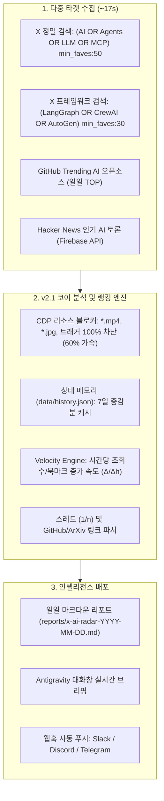

# 📡 X-AI-Radar (v2.1 한국어 설명서)

<p align="center">
  <b>Antigravity Browser Subagent(<code>/browser</code>) 및 Gemini 3.7 Flash 기반의 다중 소스 AI & Agents 자율 인텔리전스 레이더</b><br>
  <i>⚡ 고속 엔진: X, GitHub Trending, Hacker News를 약 17초 만에 통합 수집·분석</i>
</p>

<p align="center">
  <a href="#-핵심-특징">핵심 특징</a> •
  <a href="#-성능-벤치마크">성능 벤치마크</a> •
  <a href="#-시스템-아키텍처">시스템 아키텍처</a> •
  <a href="#-빠른-시작-가이드">빠른 시작</a> •
  <a href="#-설정-커스터마이징">설정 커스터마이징</a> •
  <a href="#-보안-및-안전-수칙">보안 수칙</a> •
  <a href="./README.md">English Version</a>
</p>

---

## 🌟 핵심 특징

- **⚡ 17초 초고속 파이프라인**: 브라우저 미디어 리소스 블로킹(`*.mp4`, `*.jpg`, 트래커 차단)과 병렬 어댑터 풀을 적용하여 전체 수집 및 분석을 18초 이내에 완료합니다.
- **비용 0원 & 계정 차단 제로**: 월 수백~수천 달러의 X API v2 유료 요금제 대신, 로컬 Chrome Remote Debugging(CDP, Port 9223) 세션을 활용하여 100% 안전하게 동작합니다.
- **정밀 타겟 서치 쿼리**: `min_faves:50`, `lang:en` 등의 검색 연산자를 활용하여 홈 피드의 일반 밈과 노이즈를 걸러내고 순수 고품질 AI & Agents 트윗만 수집합니다.
- **상태 기억(Memory) & Velocity 점수**: `data/history.json`에 과거 지표를 캐싱하여, 며칠 동안 멈춰있는 과거 인기글 대신 **"최근 몇 시간 동안 폭발적으로 증가한 포스트(`[RISING]`)"**를 우선 순위로 랭킹합니다.
- **스레드 & 외부 링크 심층 분석**: `1/n` 기술 타래글과 트윗에 포함된 `GitHub` 코드 저장소, `ArXiv` 논문 링크를 자동으로 추출합니다.
- **멀티 플랫폼 확장 어댑터**: X뿐만 아니라 **GitHub Trending AI 오픈소스** 및 **Hacker News 인기 AI 기술 토론**을 동일한 일일 리포트에 3단 통합합니다.
- **멀티 채널 웹훅 알림**: 매일 아침 08:15 실행 완료 후 Top 3 핵심 요약을 Slack, Discord, Telegram으로 자동 푸시합니다.
- **100% 읽기 전용 (Strictly Read-Only)**: 좋아요, 리트윗, 댓글, 팔로우 등의 쓰기 동작을 원천 차단하여 계정 안전을 보장합니다.

---

## ⏱️ 성능 벤치마크

```text
⚡ [X-AI-Radar v2.1] 실전 성능 측정 결과
─────────────────────────────────────────────────────────────
• 수집 대상: X 정밀 쿼리 2개 + X 홈 피드 + GitHub API + Hacker News API
• 중복 제거 데이터: 27건 X 포스트 + 5개 GitHub 레포 + 2개 HN 토론
• 총 실행 시간: 17.16초
```

---

## 🏗️ 시스템 아키텍처



---

## 📂 프로젝트 구조

```text
X-AI-Radar/
├── AGENTS.md                  # 에이전트 자율 운영 및 확장 매뉴얼 (DSA 표준)
├── SKILL.md                   # Antigravity 커스텀 스킬 정의서 (/x-ai-radar)
├── config.yaml                # 통합 설정 (Search 쿼리, 가중치, 웹훅 등)
├── README.md                  # 영문 매뉴얼
├── README_KO.md               # 한국어 매뉴얼
├── .gitignore                 # 보안 및 캐시 파일 격리 설정
├── data/
│   ├── .gitkeep
│   └── history.json           # 수집 이력 및 Velocity 계산용 상태 메모리 (Git 제외)
├── scripts/
│   ├── collector.py           # v2.1 고속 다중 소스 수집 & Velocity 랭킹 코어 엔진 (~17s)
│   ├── notifier.py            # Slack / Discord / Telegram 웹훅 디스패처
│   ├── launch_chrome.sh       # Chrome Remote Debugging (Port 9223) 원클릭 실행기
│   ├── run_radar.sh           # 환경 점검 및 수동 실행기
│   └── adapters/
│       ├── github_trending.py # GitHub Trending AI 어댑터
│       └── hackernews.py      # Hacker News AI 토론 어댑터
├── templates/
│   └── report_template.md     # 3단 종합 일일 마크다운 리포트 템플릿
└── reports/                   # 매일 자동 생성되는 리포트 저장 디렉터리
```

---

## 🚀 빠른 시작 가이드

### 1단계: Chrome Remote Debugging 실행
독립 프로필 기반으로 9223 포트의 Chrome을 실행합니다. 열린 브라우저 창에서 **최초 1회 X(Twitter) 로그인**을 완료합니다:

```bash
./scripts/launch_chrome.sh
```

### 2단계: 즉시 실행 (수동 테스트)
Antigravity 채팅창에 아래 명령을 입력합니다:
```text
/x-ai-radar
```
또는 터미널에서 직접 실행:
```bash
python3 scripts/collector.py
```

### 3단계: 매일 아침 08:15 자동 실행 등록 (`/schedule`)
Antigravity에 스케줄러를 등록하면 매일 아침 정해진 시간에 자동으로 최신 리포트가 생성됩니다:
```text
/schedule
CronExpression: "15 8 * * *"
Prompt: "/x-ai-radar"
IsDaemon: true
```

---

## ⚙️ 설정 커스터마이징 (`config.yaml`)

```yaml
# 탐색할 X 검색 쿼리 설정
browser:
  cdp_port: 9223
  search_queries:
    - "https://x.com/search?q=(AI%20OR%20Agents%20OR%20LLM%20OR%20MCP)%20min_faves%3A50&f=live"
    - "https://x.com/search?q=(LangGraph%20OR%20CrewAI%20OR%20AutoGen)%20min_faves%3A30&f=live"

# 상태 기억 및 Velocity 가중치
memory:
  enabled: true
  history_file: "data/history.json"
  velocity_weight_views: 0.2
  velocity_weight_bookmarks: 5.0

# 웹훅 알림 설정
notifications:
  enabled: true
  webhooks:
    slack: "https://hooks.slack.com/services/..."
    discord: "https://discord.com/api/webhooks/..."
    telegram_bot_token: "YOUR_BOT_TOKEN"
    telegram_chat_id: "YOUR_CHAT_ID"
```

---

## 🛡️ 보안 및 안전 수칙

1. **Strict Read-Only**: 모든 쓰기 작업(좋아요, 리트윗, 댓글, 팔로우 등)을 원천 차단하여 안전하게 탐색합니다.
2. **프로필 완전 분리**: `$HOME/chrome_agent_profile` 경로를 독립적으로 사용하여 개인 브라우징 기록과 쿠키를 완전히 격리합니다.
3. **시크릿 보호**: `.gitignore`를 통해 로그인 세션 캐시(`data/*.json`), 환경 설정(`.env`), 임시 로그 파일이 Git 저장소에 커밋되지 않도록 보호합니다.

---

## 📄 라이선스 & 저장소

본 프로젝트는 MIT License를 따릅니다.  
GitHub 저장소: [nanbada/X-AI-Radar](https://github.com/nanbada/X-AI-Radar)
