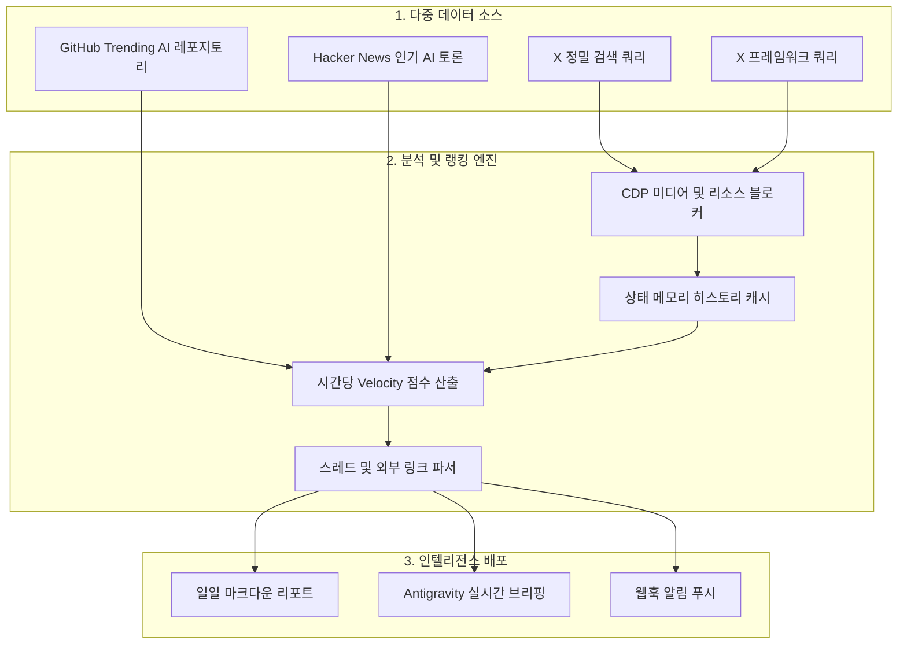

# 📡 X-AI-Radar (v2.1 한국어 설명서)

<p align="center">
  <b>Antigravity Browser Subagent(<code>/browser</code>) 및 Gemini 3.7 Flash 기반의 다중 소스 AI & Agents 자율 인텔리전스 레이더</b><br>
  <i>⚡ 고속 엔진: X, GitHub Trending, Hacker News를 약 17초 만에 통합 수집·분석</i><br>
  <i>💻 크로스 플랫폼: macOS, Windows, Linux 100% 완벽 지원</i>
</p>

<p align="center">
  <a href="#-핵심-특징">핵심 특징</a> •
  <a href="#-성능-벤치마크">성능 벤치마크</a> •
  <a href="#-시스템-아키텍처">시스템 아키텍처</a> •
  <a href="#-빠른-시작-가이드-macos--windows--linux">빠른 시작 (macOS / Windows)</a> •
  <a href="#-검색-이슈-및-주제-변경-방법">주제 변경 방법</a> •
  <a href="#-설정-커스터마이징">설정 커스터마이징</a> •
  <a href="#-보안-및-안전-수칙">보안 수칙</a> •
  <a href="./README.md">English Version</a>
</p>

---

## 🌟 핵심 특징

- **⚡ 17초 초고속 파이프라인**: 브라우저 미디어 리소스 블로킹(`*.mp4`, `*.jpg`, 트래커 차단)과 병렬 어댑터 풀을 적용하여 전체 수집 및 분석을 18초 이내에 완료합니다.
- **💻 완벽한 윈도우(Windows) & Mac 지원**: macOS/Linux용(`.sh`), Windows 배치 파일(`.bat`), PowerShell(`.ps1`) 전용 원클릭 실행기를 모두 제공합니다.
- **비용 0원 & 계정 차단 제로**: 월 수백~수천 달러의 X API v2 유료 요금제 대신, 로컬 Chrome Remote Debugging(CDP, Port 9223) 세션을 활용하여 100% 안전하게 동작합니다.
- **정밀 타겟 서치 쿼리**: `min_faves:50`, `lang:en` 등의 검색 연산자를 활용하여 홈 피드의 일반 밈과 노이즈를 걸러내고 순수 고품질 AI & Agents 트윗만 수집합니다.
- **상태 기억(Memory) & Velocity 점수**: `data/history.json`에 과거 지표를 캐싱하여, 며칠 동안 멈춰있는 과거 인기글 대신 **"최근 몇 시간 동안 폭발적으로 증가한 포스트(`[RISING]`)"**를 우선 순위로 랭킹합니다.
- **스레드 & 외부 링크 심층 분석**: `1/n` 기술 타래글과 트윗에 포함된 `GitHub` 코드 저장소, `ArXiv` 논문 링크를 자동으로 추출합니다.
- **멀티 플랫폼 확장 어댑터**: X뿐만 아니라 **GitHub Trending AI 오픈소스** 및 **Hacker News 인기 AI 기술 토론**을 동일한 일일 리포트에 3단 통합합니다.
- **텔레그램 한국어 자동 번역 알림**: 매일 아침 08:15 실행 완료 후 Top 3 핵심 요약을 **한국어로 번역하여 텔레그램(`@Radar4All_bot`)으로 자동 발송**합니다.
- **100% 읽기 전용 (Strictly Read-Only)**: 좋아요, 리트윗, 댓글, 팔로우 등의 쓰기 동작을 원천 차단하여 계정 안전을 보장합니다.

---

## ⏱️ 성능 벤치마크

```text
⚡ [X-AI-Radar v2.1] 실전 성능 측정 결과
─────────────────────────────────────────────────────────────
• 수집 대상: X 정밀 쿼리 2개 + X 홈 피드 + GitHub API + Hacker News API
• 중복 제거 데이터: 27건 X 포스트 + 5개 GitHub 레포 + 2개 HN 토론
• 총 실행 시간: 17.16초
```

---

## 🏗️ 시스템 아키텍처



---

## 📂 프로젝트 구조

```text
X-AI-Radar/
├── AGENTS.md                  # 에이전트 자율 운영 및 확장 매뉴얼 (DSA 표준)
├── SKILL.md                   # Antigravity 커스텀 스킬 정의서 (/x-ai-radar)
├── config.yaml                # 통합 설정 (Search 쿼리, 가중치, 웹훅 등)
├── README.md                  # 영문 매뉴얼
├── README_KO.md               # 한국어 매뉴얼
├── .gitignore                 # 보안 및 캐시 파일 격리 설정
├── .env                       # 텔레그램 봇 토큰 및 챗 ID (Git 제외)
├── data/
│   ├── .gitkeep
│   └── history.json           # 수집 이력 및 Velocity 계산용 상태 메모리 (Git 제외)
├── scripts/
│   ├── collector.py           # v2.1 고속 다중 소스 수집 & Velocity 랭킹 코어 엔진 (~17s)
│   ├── notifier.py            # Slack / Discord / 텔레그램 한국어 자동 번역 발송기
│   ├── launch_chrome.sh       # macOS / Linux용 Chrome 실행기
│   ├── launch_chrome.bat      # Windows CMD용 Chrome 원클릭 실행기
│   ├── launch_chrome.ps1      # Windows PowerShell용 Chrome 실행기
│   ├── run_radar.sh           # macOS / Linux용 점검 및 수동 실행기
│   ├── run_radar.bat          # Windows용 점검 및 수동 실행기
│   └── adapters/
│       ├── github_trending.py # GitHub Trending AI 어댑터
│       └── hackernews.py      # Hacker News AI 토론 어댑터
├── templates/
│   └── report_template.md     # 3단 종합 일일 마크다운 리포트 템플릿
└── reports/                   # 매일 자동 생성되는 리포트 저장 디렉터리
```

---

## 🚀 빠른 시작 가이드 (macOS / Windows / Linux)

### 1단계: Chrome Remote Debugging 모드 실행 (Port 9223)

* **macOS / Linux 사용자**:
  ```bash
  ./scripts/launch_chrome.sh
  ```
* **Windows 사용자 (CMD / 더블 클릭)**:
  `scripts\launch_chrome.bat` 파일을 더블 클릭하거나 명령 프롬프트에서 실행:
  ```cmd
  scripts\launch_chrome.bat
  ```
* **Windows 사용자 (PowerShell)**:
  ```powershell
  .\scripts\launch_chrome.ps1
  ```

> [!NOTE]
> 열린 크롬 창에서 **최초 1회 X(Twitter) 로그인**을 완료합니다. 로그인 세션은 독립 프로필(`chrome_agent_profile`)에 안전하게 저장되어 다음부터 자동으로 유지됩니다.

### 2단계: X-AI-Radar 실행

* **Antigravity 채팅창에서 실행**:
  ```text
  /x-ai-radar
  ```
* **터미널 / 명령 프롬프트에서 직접 실행**:
  ```bash
  python scripts/collector.py
  ```
* **Windows 원클릭 실행**:
  `scripts\run_radar.bat` 파일을 더블 클릭하여 즉시 실행

### 3단계: 매일 아침 08:15 자동 실행 등록 (`/schedule`)
Antigravity에 스케줄러를 등록하면 매일 아침 정해진 시간에 자동으로 최신 리포트가 생성되고 텔레그램으로 전송됩니다:
```text
/schedule
CronExpression: "15 8 * * *"
Prompt: "/x-ai-radar"
IsDaemon: true
```

---

## 🎯 검색 이슈 및 주제 변경 방법 (Customization)

`config.yaml` 파일만 수정하면 **로보틱스(Robotics), Web3, 헬스케어 AI, 퀀트 금융, 특정 모델(Claude, DeepSeek, Grok) 등** 원하는 모든 도메인으로 레이더를 손쉽게 전환할 수 있습니다.

### 1. 탐색할 X 검색 쿼리 변경 (`browser.search_queries`)
X(Twitter)의 공식 검색 연산자(`min_faves`, `lang`, `OR`/`AND`, `-filter:replies` 등)를 조합하여 원하는 URL을 등록합니다:

```yaml
browser:
  search_queries:
    # 예시 A: AI Agents & 추론 모델 집중 추적
    - "https://x.com/search?q=(AI%20OR%20Agents%20OR%20Reasoning%20OR%20MCP)%20min_faves%3A50&f=live"
    
    # 예시 B: 로보틱스 & 피지컬 AI 도메인으로 변경
    - "https://x.com/search?q=(Robotics%20OR%20Humanoid%20OR%20PhysicalAI)%20min_faves%3A30&f=live"
    
    # 예시 C: 한국어 테크/AI 토론 위주로 수집
    - "https://x.com/search?q=(인공지능%20OR%20LLM%20OR%20에이전트)%20min_faves%3A10&f=live"
```

### 2. 가산점 키워드 지정 (`topics.boost_keywords`)
해당 키워드가 본문에 포함되면 자동으로 **+150점의 Heat Score 보너스**와 함께 우선 순위 태그가 부여됩니다:

```yaml
topics:
  primary:
    - "Robotics"
    - "Autonomous Agents"
  boost_keywords:
    - "Humanoid"
    - "Physical AI"
    - "ROS"
    - "LangGraph"
    - "MCP"
```

### 3. 노이즈 및 제외 키워드 관리 (`topics.exclude_keywords`)
새로운 도메인에 불필요한 스팸, 스포츠, 무관한 이슈를 차단합니다:

```yaml
topics:
  exclude_keywords:
    - "airdrop"
    - "giveaway"
    - "memecoin"
    - "football"
    - "transfer"
```

---

## ⚙️ 설정 커스터마이징 (`config.yaml`)

```yaml
# 수집 윈도우 및 선정 개수
filter:
  window_hours: 24             # 최근 24시간 윈도우
  top_select_count: 10         # 리포트에 수록할 Top 포스트 수

# 상태 기억 및 Velocity 가중치
memory:
  enabled: true
  history_file: "data/history.json"
  velocity_weight_views: 0.2
  velocity_weight_bookmarks: 5.0

# 웹훅 알림 설정 (.env 또는 config.yaml)
notifications:
  enabled: true
  webhooks:
    slack: ""
    discord: ""
    telegram_bot_token: ""     # .env 파일에서 자동 로드
    telegram_chat_id: ""       # .env 파일에서 자동 로드
```

---

## 🛡️ 보안 및 안전 수칙

1. **Strict Read-Only**: 모든 쓰기 작업(좋아요, 리트윗, 댓글, 팔로우 등)을 원천 차단하여 안전하게 탐색합니다.
2. **프로필 완전 분리**: `chrome_agent_profile` 경로를 독립적으로 사용하여 개인 브라우징 기록과 쿠키를 완전히 격리합니다.
3. **시크릿 보호**: `.gitignore`를 통해 로그인 세션 캐시(`data/*.json`), 환경 설정(`.env`), 임시 로그 파일이 Git 저장소에 커밋되지 않도록 보호합니다.

---

## 📄 라이선스 & 저장소

본 프로젝트는 MIT License를 따릅니다.  
GitHub 저장소: [nanbada/X-AI-Radar](https://github.com/nanbada/X-AI-Radar)
